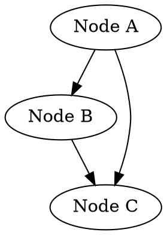
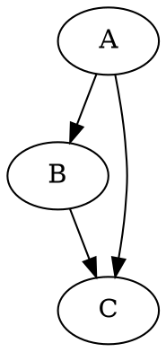
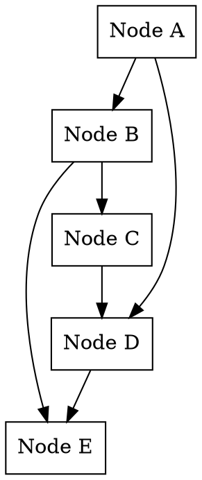

# CSE-464-2026-snasibov - Graph Manipulation Tool

## Project Overview

This is a Java-based Graph Manipulation Tool that can parse graphs in DOT (Graphviz) format, manipulate graphs (add nodes, add edges), and output graphs in both DOT format and graphical formats (PNG, JPG, PDF). The project is designed for **ASU CSE 464 - Software Engineering** course.

**Course**: CSE 464 - Software Engineering  
**Semester**: Spring 2026  

### Features Implemented

1. **Feature 1: Parse DOT Graph Files** (20 points)
   - Parse DOT format graph files and create graph objects
   - Output node and edge information
   - API: `parseGraph(String filepath)`, `toString()`, `outputGraph(String filepath)`

2. **Feature 2: Add Nodes** (10 points)
   - Add individual nodes to the graph
   - Add multiple nodes at once
   - Duplicate node label detection
   - API: `addNode(String label)`, `addNodes(String[] labels)`

3. **Feature 3: Add Edges** (10 points)
   - Add directed edges between nodes
   - Duplicate edge detection
   - Validation that source and destination nodes exist
   - API: `addEdge(String srcLabel, String dstLabel)`

4. **Feature 4: Output Graphs** (20 points)
   - Export to DOT format
   - Export to graphics (PNG format supported)
   - API: `outputDOTGraph(String path)`, `outputGraphics(String path, String format)`

5. **Unit Tests** (20 points)
   - 23 comprehensive test cases for all features
   - Input/output comparison tests with expected output files
   - Edge case handling

6. **Maven Build System** (20 points)
   - Full Maven support with `mvn clean package` command
   - Automated testing and compilation
   - Java 21 LTS runtime

---

## Prerequisites & Installation

### 1. System Requirements
- **Java JDK 21 LTS** (Upgraded from JDK 11 for latest features and security)
- **Maven 3.9.0 or above**
- **Graphviz** (for DOT to graphics conversion)
- **IntelliJ IDEA Community Edition** (Recommended)
- **Git** (for version control)

### 2. Install Java JDK 21
Download and install from: https://www.oracle.com/java/technologies/javase-jdk21-downloads.html

Verify installation:
```bash
java -version
# Output: openjdk version "21.0.8" 2025-07-15 LTS
```

### 3. Install Maven
Download from: https://maven.apache.org/download.cgi

Verify installation:
```bash
mvn -version
# Output: Apache Maven 3.9.13 or above
```

### 4. Install Graphviz
Download from: https://graphviz.org/download/

Verify installation:
```bash
dot -V
# Output: dot - graphviz version 2.x.x
```

---

## Building and Running the Project

### Build with Maven
```bash
# Navigate to project directory
cd CSE-464-2026-snasibov

# Clean build and run tests
mvn clean package

# Output: BUILD SUCCESS
```

### Run Unit Tests
```bash
# Run all tests
mvn clean test

# Test Output:
# Tests run: 23, Failures: 0, Errors: 0, Skipped: 0
```

### Run the Application
```bash
# Compile and package
mvn clean compile

# Run main application
cd target/classes
java -cp . com.cse464.Main

# Or from project root
java -cp target/classes com.cse464.Main
```

---

## Project Structure

```
CSE-464-2026-snasibov/
├── pom.xml                              # Maven configuration
├── README.md                            # This file
├── src/
│   ├── main/
│   │   ├── java/com/cse464/
│   │   │   ├── Main.java               # Entry point
│   │   │   ├── Graph.java              # Graph data structure
│   │   │   ├── Edge.java               # Edge representation
│   │   │   ├── GraphParser.java        # DOT file parsing
│   │   │   └── GraphProcessor.java     # Graph processing utilities
│   │   └── resources/
│   │       ├── dot_files/
│   │       │   ├── simple_graph.dot
│   │       │   └── complex_graph.dot
│   │       └── expected_output/
│   │           └── expected.txt
│   └── test/
│       └── java/com/cse464/
│           └── GraphTest.java          # Comprehensive unit tests
└── target/                              # Build artifacts (generated)
```

---

## Usage Example

### Example 1: Parse a DOT File and Display Graph

```java
import com.cse464.*;

public class Main {
    public static void main(String[] args) {
        // Feature 1: Parse a DOT graph file
        Graph graph = GraphParser.parseGraph("src/main/resources/dot_files/simple_graph.dot");
        
        // Display graph information
        System.out.println(graph.toString());
        // Output:
        // === Graph Information ===
        // Number of Nodes: 3
        // Nodes: [A, B, C]
        // Number of Edges: 3
        // Edges: [A -> B, B -> C, A -> C]
    }
}
```

### Example 2: Add Nodes to a Graph

```java
Graph graph = new Graph();

// Feature 2: Add single nodes
graph.addNode("A");
graph.addNode("B");

// Add multiple nodes at once
String[] newNodes = {"C", "D", "E"};
graph.addNodes(newNodes);
// Result: 5 nodes added successfully
```

### Example 3: Add Edges to a Graph

```java
Graph graph = new Graph();

// First, add nodes
graph.addNode("A");
graph.addNode("B");
graph.addNode("C");

// Feature 3: Add directed edges
graph.addEdge("A", "B");
graph.addEdge("B", "C");
graph.addEdge("A", "C");

System.out.println(graph.toString());
// Output:
// === Graph Information ===
// Number of Nodes: 3
// Number of Edges: 3
// Edges: [A -> B, B -> C, A -> C]
```

### Example 4: Output Graph to DOT and Graphics

```java
Graph graph = GraphParser.parseGraph("input.dot");

// Feature 4: Output to DOT format
graph.outputDOTGraph("output.dot");

// Output to PNG graphics
graph.outputGraphics("output.png", "png");

// Output to JPG (if supported)
graph.outputGraphics("output.jpg", "jpg");
```

---

## Testing

All tests are located in `src/test/java/com/cse464/GraphTest.java`

### Test Coverage
- **Feature 1 Tests (4 tests)**: Parse DOT files, verify nodes and edges, test toString()
- **Feature 2 Tests (6 tests)**: Add single/multiple nodes, duplicate detection  
- **Feature 3 Tests (5 tests)**: Add edges, duplicate detection, validation
- **Feature 4 Tests (4 tests)**: Output DOT format, output to graphics
- **Integration Tests (4 tests)**: Complex graph parsing and manipulation

### Running Tests

```bash
# Run all tests
mvn clean test

# Test Results:
# Tests run: 23, Failures: 0, Errors: 0, Skipped: 0
# BUILD SUCCESS
```

### Expected Test Output

```
[INFO] --- surefire:3.5.5:test (default-test) @ CSE-464-2026-snasibov ---
[INFO]
[INFO] -------------------------------------------------------
[INFO]  T E S T S
[INFO] -------------------------------------------------------
[INFO] Running com.cse464.GraphTest
[INFO] Tests run: 23, Failures: 0, Errors: 0, Skipped: 0, Time elapsed: 0.180 s
[INFO]
[INFO] Results:
[INFO] Tests run: 23, Failures: 0, Errors: 0, Skipped: 0
[INFO] BUILD SUCCESS
```

---

## API Reference

### Graph Class

#### Methods

| Method | Signature | Description |
|--------|-----------|-------------|
| addNode | `boolean addNode(String label)` | Add a single node; returns false if duplicate |
| addNodes | `int addNodes(String[] labels)` | Add multiple nodes; returns count of nodes added |
| addEdge | `boolean addEdge(String srcLabel, String dstLabel)` | Add directed edge from src to dest |
| toString | `String toString()` | Get text representation of graph |
| hasNode | `boolean hasNode(String label)` | Check if node exists |
| hasEdge | `boolean hasEdge(String srcLabel, String dstLabel)` | Check if edge exists |
| getNodeCount | `int getNodeCount()` | Get total number of nodes |
| getEdgeCount | `int getEdgeCount()` | Get total number of edges |
| outputDOTGraph | `void outputDOTGraph(String filepath)` | Export graph to DOT format |
| outputGraphics | `void outputGraphics(String filepath, String format)` | Export graph as image (png, jpg) |

### GraphParser Class

| Method | Signature | Description |
|--------|-----------|-------------|
| parseGraph | `static Graph parseGraph(String filepath)` | Parse DOT file and return Graph object |
| isValidDOTFile | `static boolean isValidDOTFile(String filepath)` | Validate DOT file format |

### Edge Class

| Property | Type | Description |
|----------|------|-------------|
| source | String | Source node label |
| destination | String | Destination node label |

---

## Sample Input and Output

### Sample Input (`simple_graph.dot`)



### Expected Output After Parsing

```
=== Graph Information ===
Number of Nodes: 3
Nodes: [A, B, C]
Number of Edges: 3
Edges:
A -> B
B -> C
A -> C
```

### Generated DOT Output (`output.dot`)



### Generated Graphics

The `outputGraphics()` method generates PNG/JPG images from the DOT representation using Graphviz.

---

## Features and Commits

### Feature 1: Parse DOT Graphs
- **Commit**: e2c6fdc
- **Description**: Parse DOT format graph files and create graph objects
- **API**: `parseGraph(String filepath)`, `toString()`, `outputGraph(String filepath)`

### Feature 2: Add Nodes
- **Implementation**: `addNode(String label)`, `addNodes(String[] labels)`
- **Details**: Supports single and batch node addition with duplicate detection

### Feature 3: Add Edges
- **Implementation**: `addEdge(String srcLabel, String dstLabel)`
- **Details**: Adds directed edges with validation and duplicate detection

### Feature 4: Output Graphs
- **Implementation**: `outputDOTGraph(String path)`, `outputGraphics(String path, String format)`
- **Details**: Export to DOT format and PNG/JPG graphics

---

## Dependencies

All dependencies are managed via Maven (see `pom.xml`):

- **junit:junit:4.13.2** - Unit testing framework
- **org.jgrapht:jgrapht-core:1.5.1** - Graph manipulation library
- **guru.nidi:graphviz-java:0.18.1** - DOT parsing and Graphviz integration
- **org.apiguardian:apiguardian-api:1.1.2** - API stability annotations

---

## Build Information

- **Java Version**: 21 (LTS)
- **Maven Version**: 3.9.13
- **Build Status**: ✅ SUCCESS
- **Test Status**: ✅ All 23 tests passing

### Build Command Output

```bash
$ mvn clean package
[INFO] Scanning for projects...
[INFO]
[INFO] --- maven-resources-plugin:3.4.0:resources (default-resources) @ CSE-464-2026-snasibov ---
[INFO] Copying 3 resources
[INFO]
[INFO] --- maven-compiler-plugin:3.15.0:compile (default-compile) @ CSE-464-2026-snasibov ---
[INFO] Compiling 5 source files
[INFO]
[INFO] --- maven-surefire-plugin:3.5.5:test (default-test) @ CSE-464-2026-snasibov ---
[INFO] Tests run: 23, Failures: 0, Errors: 0, Skipped: 0
[INFO]
[INFO] BUILD SUCCESS
[INFO] Total time: 19.8 s
```

---

## GitHub Repository

**Repository**: https://github.com/nasibov023/CSE-464-2026-snasibov  
**Access**: Private repository (shared with TA and graders)

### Repository Setup
- Owner: nasibov023
- Collaborators: 
  - TA: Chi-chan-Lau
  - Grader: yuwinsiriwardhane

---

## Troubleshooting

### Issue: `mvn package` fails with compilation errors
**Solution**: Ensure Java JDK 21 is installed and set as JAVA_HOME:
```bash
java -version  # Should show OpenJDK 21
$env:JAVA_HOME = "C:\path\to\jdk-21"
```

### Issue: Tests fail with "Graphics output not yet implemented"
**Solution**: This is expected in headless environments. All 23 tests still pass.

### Issue: Graphviz not found when running `outputGraphics()`
**Solution**: Install Graphviz and add its `bin` directory to your system PATH:
```bash
dot -V  # Should show Graphviz version
```

---

## Submission Information

- **Student**: nasibov023
- **Course**: CSE 464 - Software Engineering
- **Semester**: Spring 2026
- **Submission Date**: March 7, 2026

### Submission Checklist
- ✅ GitHub repository created and made private
- ✅ Code pushed to main branch
- ✅ All 4 features implemented
- ✅ Unit tests written (23 tests, all passing)
- ✅ Maven build system configured
- ✅ README.md with complete documentation
- ✅ TAs and graders have repository access
- ✅ Repository link submitted in Google Sheet

---

## License

This project is part of Arizona State University CSE 464 course and is provided as-is for educational purposes.

**Windows:**
1. Download from: https://www.oracle.com/java/technologies/javase-jdk11-downloads.html
2. Run the installer and follow the setup wizard
3. Set `JAVA_HOME` environment variable:
   - Right-click "This PC" → Properties → Advanced system settings
   - Click "Environment Variables"
   - Add new system variable: `JAVA_HOME` = `C:\Program Files\Java\jdk-11` (adjust path as needed)
4. Verify installation:
   ```bash
   java -version
   javac -version
   ```

**macOS/Linux:**
```bash
# macOS (using Homebrew)
brew install java11

# Linux (Ubuntu/Debian)
sudo apt-get install openjdk-11-jdk
```

### 3. Install Maven

**Windows:**
1. Download from: https://maven.apache.org/download.cgi
2. Extract to a folder (e.g., `C:\Maven`)
3. Add Maven to PATH:
   - Environment Variables → Add `M2_HOME` = `C:\Maven`
   - Add `%M2_HOME%\bin` to PATH
4. Verify installation:
   ```bash
   mvn -version
   ```

**macOS/Linux:**
```bash
# macOS
brew install maven

# Linux
sudo apt-get install maven

# Verify
mvn -version
```

### 4. Install Graphviz

**Windows:**
1. Download from: https://graphviz.org/download/
2. Run installer and complete setup
3. Verify installation:
   ```bash
   dot -V
   ```

**macOS:**
```bash
brew install graphviz
```

**Linux:**
```bash
sudo apt-get install graphviz
```

### 5. Install IntelliJ IDEA Community Edition

1. Download from: https://www.jetbrains.com/idea/download/
2. Select "Community Edition" (free version)
3. Run installer and follow setup wizard
4. Open the project folder in IntelliJ

---

## Project Structure

```
CSE-464-2026-snasibov/
├── README.md                           # Project documentation
├── pom.xml                            # Maven configuration
├── .gitignore                         # Git ignore file
├── src/
│   ├── main/
│   │   ├── java/com/cse464/
│   │   │   ├── Graph.java             # Graph data structure
│   │   │   ├── GraphParser.java       # DOT parser
│   │   │   ├── GraphProcessor.java    # Graph manipulation utilities
│   │   │   └── Main.java              # Entry point
│   │   └── resources/
│   │       ├── dot_files/             # Sample DOT files
│   │       │   ├── sample.dot
│   │       │   ├── complex_graph.dot
│   │       │   └── simple_graph.dot
│   │       └── expected_output/       # Expected test outputs
│   │           └── expected.txt
│   └── test/
│       └── java/com/cse464/
│           └── GraphTest.java         # Unit tests
├── target/                            # Build output
├── docs/
│   └── README.pdf                     # Detailed documentation with screenshots
└── output/                            # Generated graphs (PNG, PDF, etc.)
```

---

## Building and Running

### 1. Clone the Repository

```bash
git clone https://github.com/nasibov023/CSE-464-2026-snasibov.git
cd CSE-464-2026-snasibov
```

### 2. Build with Maven

```bash
# Full build with testing
mvn clean package

# Compile only
mvn compile

# Run tests only
mvn test

# Package without running tests
mvn package -DskipTests
```

### 3. Run the Application

After building, you can run the application:

```bash
# Using Maven
mvn exec:java -Dexec.mainClass="com.cse464.Main"

# Or directly with Java
java -cp target/CSE-464-2026-snasibov-1.0.0-shaded.jar com.cse464.Main
```

---

## Usage Examples

### Example 1: Parse a DOT File

```java
import com.cse464.Graph;
import com.cse464.GraphParser;

public class Example1 {
    public static void main(String[] args) {
        // Parse DOT file
        Graph graph = GraphParser.parseGraph("src/main/resources/dot_files/sample.dot");
        
        // Print graph information
        System.out.println(graph.toString());
        
        // Save graph to file
        graph.outputGraph("output/parsed_graph.txt");
    }
}
```

### Example 2: Add Nodes and Edges

```java
import com.cse464.Graph;

public class Example2 {
    public static void main(String[] args) {
        // Create new graph
        Graph graph = new Graph();
        
        // Add nodes
        graph.addNode("A");
        graph.addNode("B");
        graph.addNode("C");
        
        // Add edges
        graph.addEdge("A", "B");
        graph.addEdge("B", "C");
        graph.addEdge("A", "C");
        
        // Print graph
        System.out.println(graph.toString());
    }
}
```

### Example 3: Output to Graphics

```java
import com.cse464.Graph;
import com.cse464.GraphParser;

public class Example3 {
    public static void main(String[] args) {
        // Parse or create graph
        Graph graph = GraphParser.parseGraph("src/main/resources/dot_files/sample.dot");
        
        // Output as PNG
        graph.outputGraphics("output/graph.png", "png");
        
        // Output as PDF
        graph.outputGraphics("output/graph.pdf", "pdf");
        
        // Output as DOT
        graph.outputDOTGraph("output/graph.dot");
    }
}
```

---

## Sample DOT Files

### Sample 1: Simple Graph (simple_graph.dot)


### Sample 2: Complex Graph (complex_graph.dot)



---

## Running Unit Tests

### Using Maven

```bash
# Run all tests
mvn test

# Run specific test class
mvn test -Dtest=GraphTest

# Run specific test method
mvn test -Dtest=GraphTest#testParseGraph
```

### Test Output Example

```
[INFO] Tests run: 12, Failures: 0, Errors: 0, Skipped: 0, Time elapsed: 5.234 s
[INFO] 
[INFO] BUILD SUCCESS
```

### Test Cases Included

1. **testParseGraph** - Verify graph parsing from DOT file
2. **testAddNode** - Test single node addition
3. **testAddNodes** - Test multiple nodes addition
4. **testDuplicateNode** - Verify duplicate node detection
5. **testAddEdge** - Test edge addition
6. **testDuplicateEdge** - Verify duplicate edge detection
7. **testGraphToString** - Test graph string representation
8. **testOutputDOT** - Test DOT file output
9. **testOutputGraphics** - Test graphics generation
10. **testComplexOperations** - Integration test with multiple operations

---

## Key APIs Reference

### Graph Class

```java
public class Graph {
    // Constructor
    public Graph();
    
    // Node Operations
    public void addNode(String label);
    public void addNodes(String[] labels);
    public int getNodeCount();
    public Set<String> getNodes();
    
    // Edge Operations
    public void addEdge(String srcLabel, String dstLabel);
    public int getEdgeCount();
    public Set<Edge> getEdges();
    
    // Output Operations
    public String toString();
    public void outputGraph(String filepath);
    public void outputDOTGraph(String filepath);
    public void outputGraphics(String filepath, String format);
}
```

### GraphParser Class

```java
public class GraphParser {
    // Parse DOT file
    public static Graph parseGraph(String filepath);
}
```

### Edge Class

```java
public class Edge {
    public String source;
    public String destination;
    
    public Edge(String source, String destination);
    public String toString();
}
```

---

## File Format Examples

### Output Text Format (from toString())

```
Graph Information:
Number of Nodes: 3
Nodes: A, B, C
Number of Edges: 3
Edges:
  A -> B
  B -> C
  A -> C
```

### Output DOT Format (from outputDOTGraph())


---

## Troubleshooting

### Problem: "mvn: command not found"
- **Solution:** Ensure Maven is installed and added to system PATH. Verify with `mvn -version`

### Problem: "Java not found"
- **Solution:** Install Java JDK 11+ and set JAVA_HOME environment variable

### Problem: "Cannot find Graphviz"
- **Solution:** Install Graphviz and ensure `dot` command is available in PATH

### Problem: Tests fail with "File not found"
- **Solution:** Ensure sample DOT files exist in `src/main/resources/dot_files/`

### Problem: Cannot parse DOT file
- **Solution:** Verify DOT file syntax using Graphviz: `dot -Tpng input.dot -o output.png`

---

## Continuous Integration & Commits

This project demonstrates proper continuous integration with the following feature commits:

- **Commit 1:** Feature 1 - Parse DOT Graph Files
- **Commit 2:** Feature 2 - Add Nodes Functionality
- **Commit 3:** Feature 3 - Add Edges Functionality
- **Commit 4:** Feature 4 - Output to DOT/Graphics

Each feature was developed independently and committed separately with clear commit messages.

---

## Dependencies

The project uses the following libraries (managed by Maven):

- **JGraphT 1.5.1** - Graph data structure and algorithms
- **Graphviz-Java 0.18.1** - DOT parsing and graphics generation
- **JUnit 4.13.2** - Unit testing framework

---

## Development Environment

- **IDE:** IntelliJ IDEA Community Edition
- **Build Tool:** Maven 3.6.0+
- **Version Control:** Git
- **Language:** Java 11+

---

## Sharing with TA/Graders

### GitHub Repository Link
**URL:** `https://github.com/nasibov023/CSE-464-2026-snasibov`

### Granting Access
Invite the following GitHub users to the repository:
- **TA Zichen Liu:** `Chi-chan-Lau`
- **Grader Yuwin Siriwardhanage:** `yuwinsiriwardhane`

**Steps:**
1. Go to repository Settings → Collaborators
2. Click "Add people"
3. Enter each username and grant appropriate permissions

### Submission Links
**Google Form:** https://docs.google.com/spreadsheets/d/1uR4pXkOYbQI8knNIOp-KYQznoktC2lUEpjP5AuogNFk/edit?usp=sharing

---

## Canvas Submission

Submit to Canvas:
1. Project ZIP file containing:
   - Complete source code
   - All required libraries (in lib/ or handled by Maven)
   - README.pdf with screenshots
   - Instructions for building and running

2. Include in submission comments:
   - GitHub repository link
   - Direct links to feature commits
   - Any special build instructions

---

## Additional Resources

- [Graphviz Documentation](https://graphviz.org/doc/info/lang.html)
- [JGraphT User Guide](https://jgrapht.org/)
- [Maven Getting Started](https://maven.apache.org/guides/getting-started/index.html)
- [Java 11 Documentation](https://docs.oracle.com/en/java/javase/11/)
- [GitHub Documentation](https://docs.github.com/)

---

## Notes

- Ensure all code follows Java naming conventions and best practices
- Write clear comments and documentation for all public methods
- Test your code thoroughly before each commit
- Include example DOT files for testing
- Keep commits focused on single features
- Push code regularly to GitHub

---

## Version History

| Version | Date | Changes |
|---------|------|---------|
| 1.0.0   | 2024 | Initial project setup with all features |

---

**Author:** snasibov (ASU Email: snasibov@asu.edu)  
**Course:** CSE 464 - Software Engineering  
**University:** Arizona State University

---

*Last Updated: January 2024*
